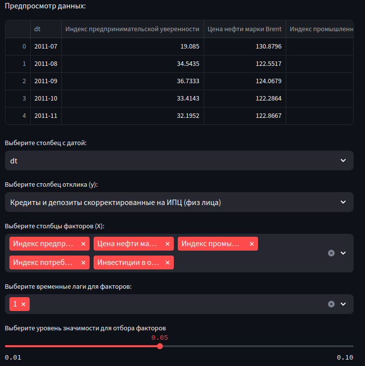
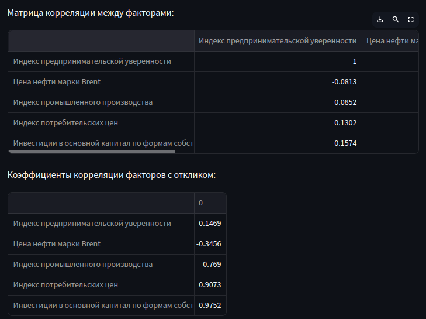
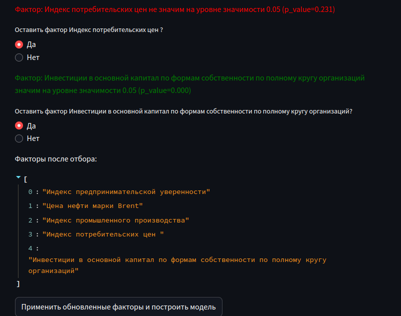
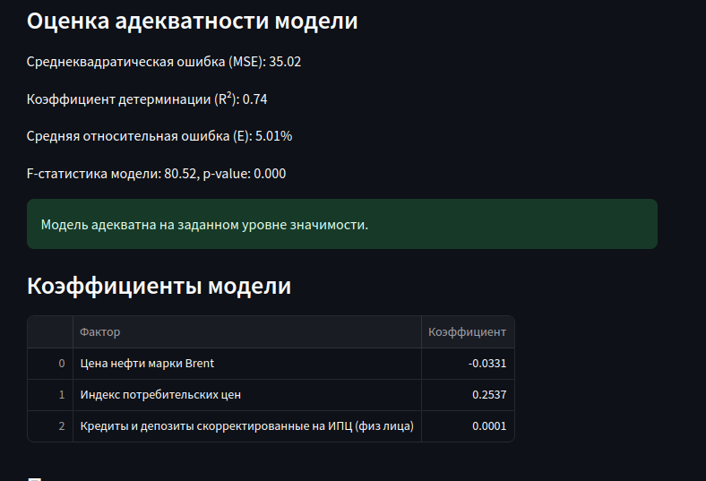
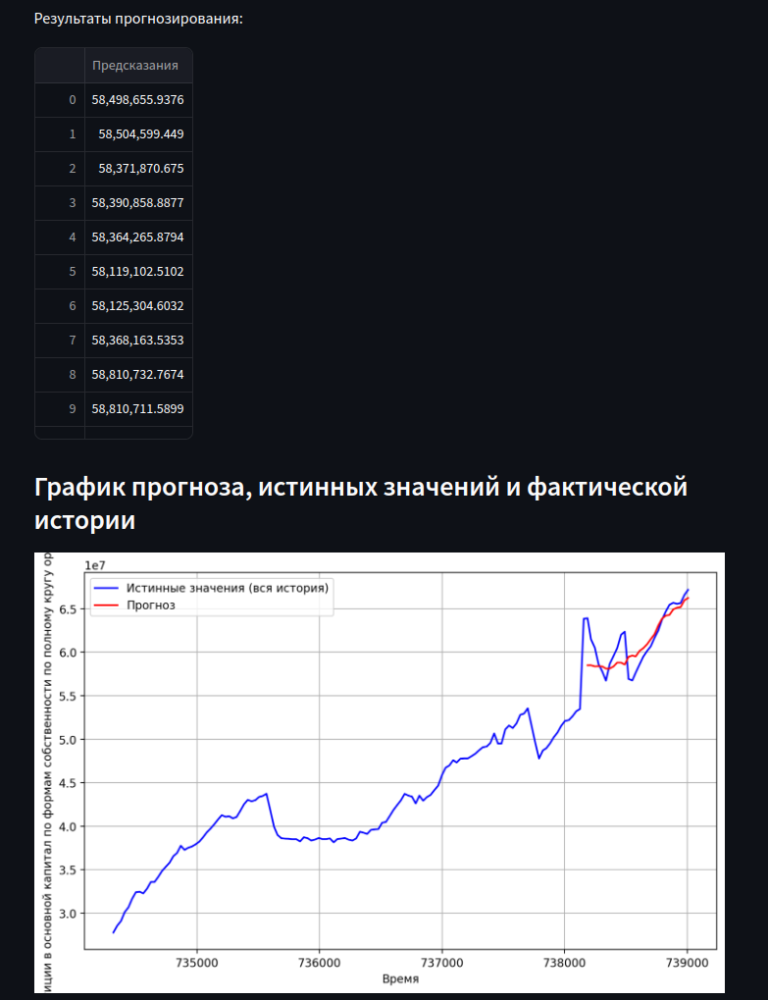

# Лабораторная работа 2. Линейная регрессия: построение, оценка адекватности и тюнинг

## Цель работы
Реализовать программу, позволяющую проектировать систему прогноза на основе множественной регрессии

## Задачи
1. Реализовать загрузку данных в формате электронных таблиц
2. Разработать функционал отбора признаков путем оценки корреляции и статистических тестов
3. Реализовать возможность использования лаговых признаков
4. Обеспечить отображение качества модели путем вывода метрик и значимости
5. Реализовать возможность прогнозирования на основе подаваемых данных

## Работа программы

Запуск осуществляется вводом команды
```bash
streamlit run multivariate_lr.py
```
После загрузки данных программа отображает первые несколько строк. Предлагается выбрать столбец с датой, столбец для отклика и столбцы, которые следует считать факторами. Также на этом этапе предлагается выбрать уровень значимости для дальнейшего отбора признаков.


Ниже отображаются корреляционные матрицы между признаками и признаков с откликом, на основе которых пользователь может принять решение о включении факторов в модель



Далее представлен интерфейс выбора факторов. Для каждого фактора рассчитывается t-статистика и отображается информация о том, значим фактор или нет. Далее отображается итоговый список факторов и предлагается построить модель с использованием отобранных факторов.



Адекватность модели оценивается путем расчета метрик и расчета F-статистики



Также реализован функционал загрузки файла с новыми данными, построение прогноза исходя из новых значений и визуализация

